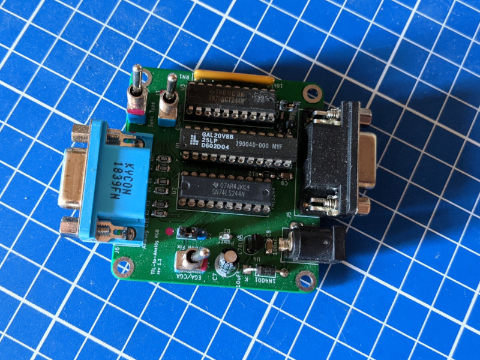
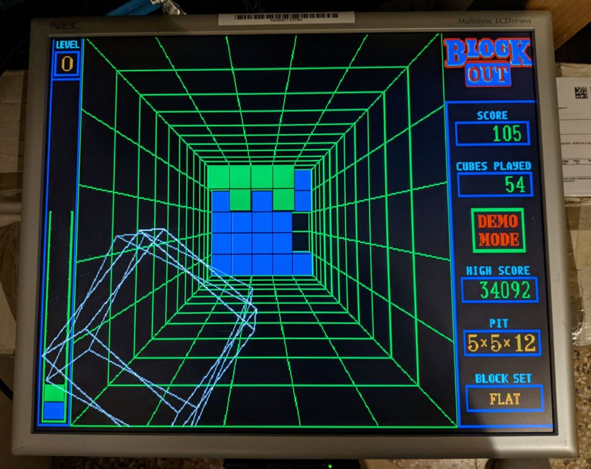
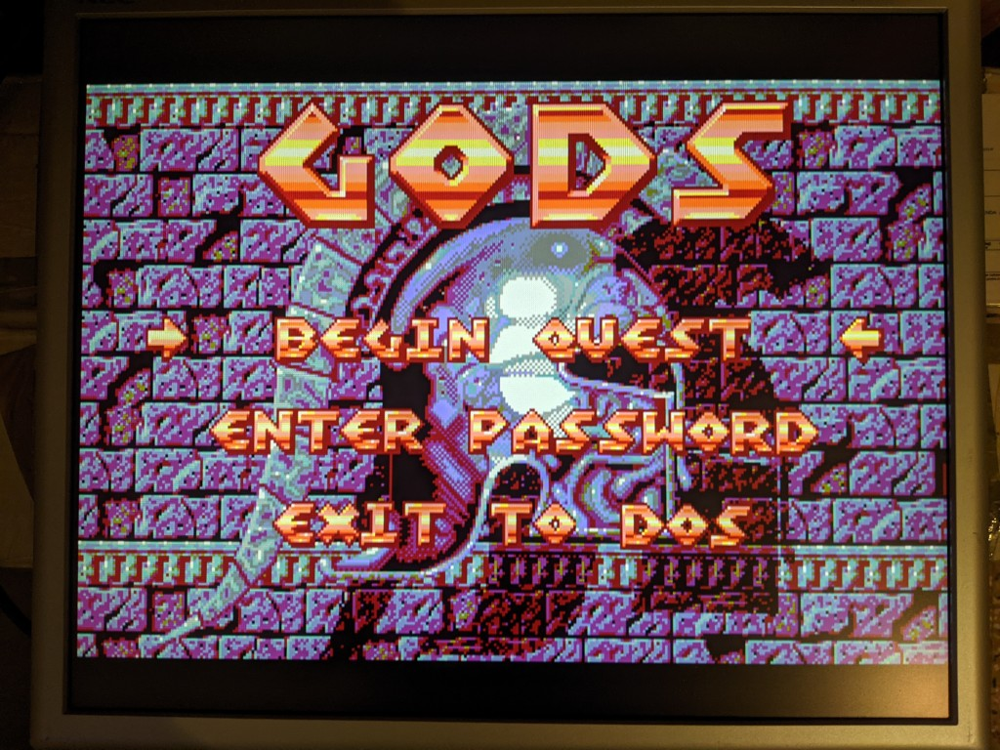
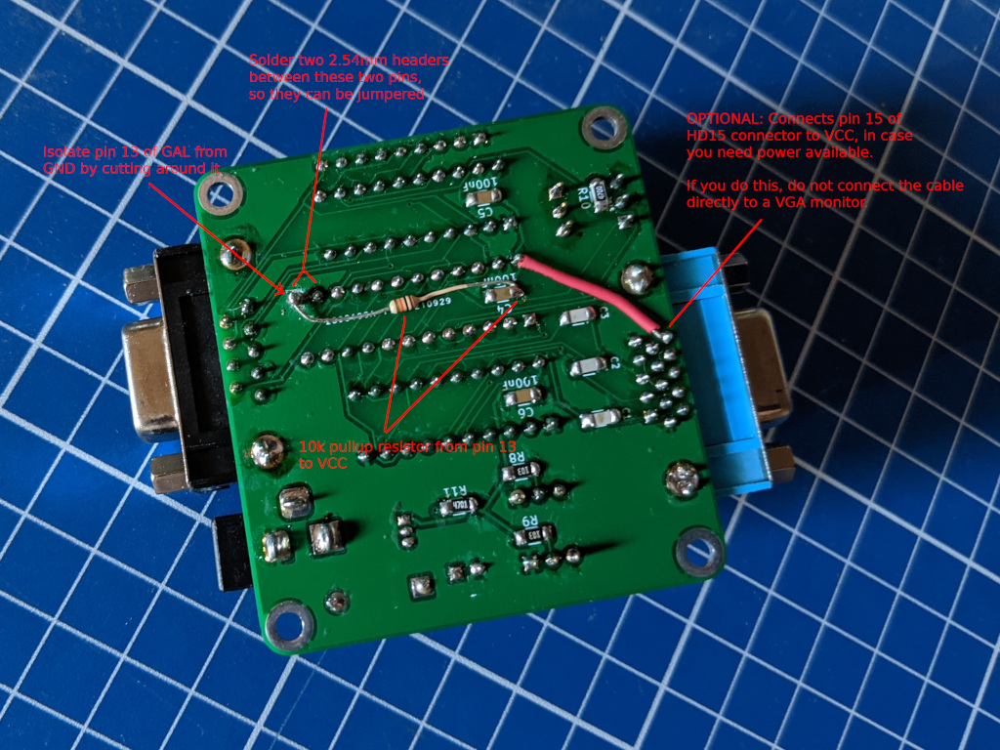

# TTL-to-ANALOG Converter

## Introduction

This board converts CGA/EGA/MDA/Hercules TTL signals into analog RGB signals that can be fed into a compatible monitor.

Depending on jumper settings, it can automatically detect MDA/Hercules, Hi-res EGA and can be forced to low-res 64 colors EGA, and can perform the "brown-fix" for CGA.

The board uses a GAL20V8 PLD to implement the conversions, sync polarity detection, brown-fix, etc.

The PLD is sandwiched between two '244 buffers to protect it from shorts and allow the user to experiment with different logic families to better handle the input. It is recommended to use an 'LS244 as the output buffer, an LS or an HCT is fine for the input.

This board does NOT perform any frequency conversion. You will need a monitor capable of syncing to 15, 18 and 21Khz.

### Pics!

Example of an hi-res EGA game

Example of a low-res EGA game, with palette choosen between the 64 EGA colors (instead of the 16 CGA colors)

### Disclaimer

I take NO responsibility for what happens if you decide to build and use this card. Your computer might crash, catch fire or be destroyed in other nasty ways.
You're encourauged to take what you deem fit from this, and use it in your projects!

### Functionalities

✅ means I tested the functionality and it works, ❌ means I tested the functionality and found issues, ? means that the functionality has yet to be tested.

* [✅] CGA
* [✅] EGA, low-res
* [✅] EGA, low-res, 64 colors
* [✅] EGA, hi-res
* [?] MDA
* [?] Hercules

## Bill of Materials

**TODO**

## Known Issues

### Rev 1.1

* Pin 13 of the GAL is tied to GND, and is currently used to switch between detection modes (CGA/MDA/HERCULES vs CGA/EGA). It can be fixed by a mod
* The board does not provide an option for power output on the HD15 connector. This can be fixed by a mod.
* With a 12v PSU the regulator gets hot. Use a PSU between 7 and 9v. Next revision will use a TO220 reg.

